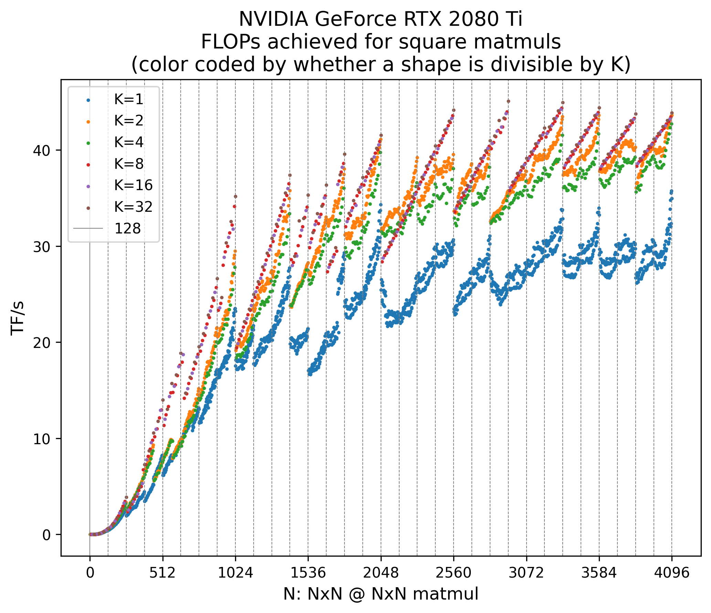

# Repro MatMul Shapes

This repository reproduces the experiment from [What Shapes Do Matrix
Multiplications Like?
[medium]](https://www.thonking.ai/p/what-shapes-do-matrix-multiplications),
which measures differences in computation speed depending on the sizes
of matrix multiplications.

## Setup

```bash
$ uv sync --locked
```

## Usage

Open
[What-Shapes-Do-Matrix-Multiplications-Like.ipynb](What-Shapes-Do-Matrix-Multiplications-Like.ipynb)
and run the cells to check how computation speed varies depending on the
matrix multiplication sizes.

The resulting CSV file and image are saved in the [output](output/)
directory.

<div style="text-align: center;">

</div>

Note that these experiments heavily depend on the performance of the
GPU.


## Resources

In creating this repository, I referred to the
[code](https://gist.github.com/Chillee/f86675147366a7a0c6e244eaa78660f7#file-4-matmul-bench-py)
of the reproduction experiment introduced in the official article. Thank you very much.

I also came across the original article through the fifth lecture of
*Stanford CS336: Language Modeling from Scratch*, available on YouTube.
Many thanks for providing such an excellent lecture. 
Below is the information for the lecture:

-   [Official course site](https://stanford-cs336.github.io/spring2025/)
-   [YouTube playlist of the
    course](https://www.youtube.com/playlist?list=PLoROMvodv4rOY23Y0BoGoBGgQ1zmU_MT_)
-   [Video of Lecture
    5](https://youtu.be/6OBtO9niT00?si=MfxxvDPFdpVBZ4Mb)
-   [Lecture 5
    slides](https://github.com/stanford-cs336/spring2025-lectures/blob/main/nonexecutable/2025%20Lecture%205%20-%20GPUs.pdf)
