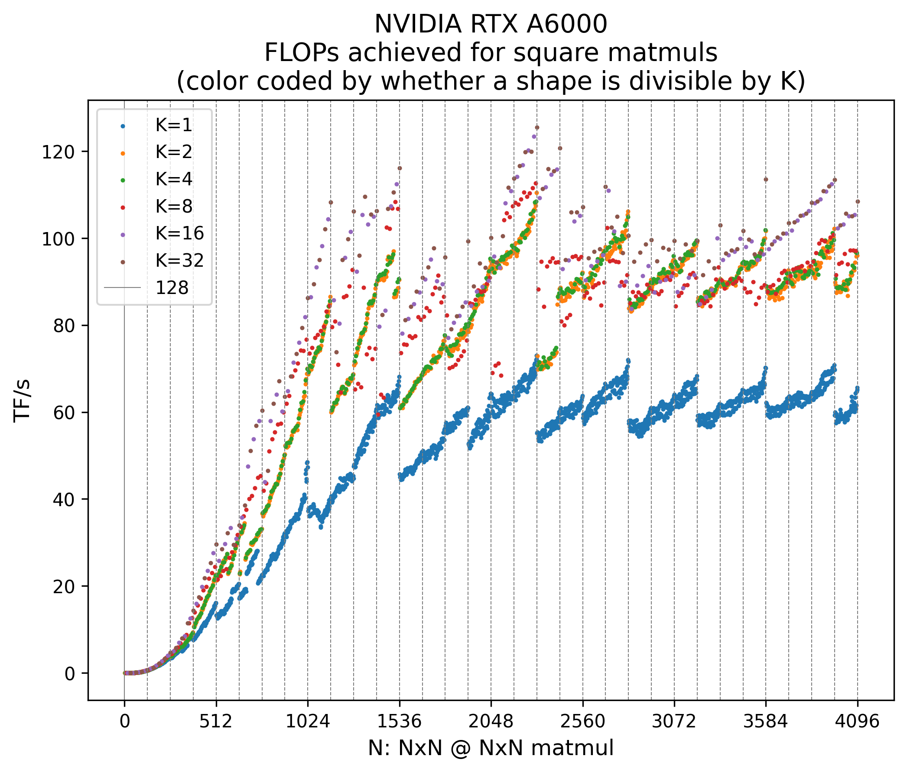
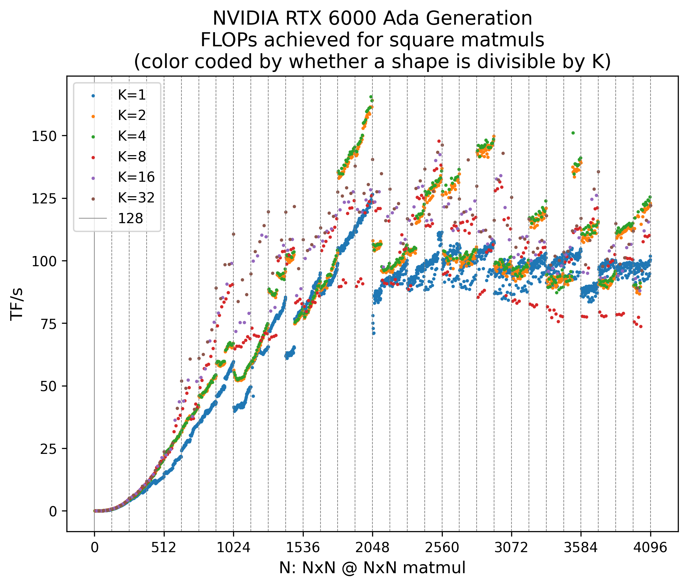

# Repro MatMul Shapes

This repository reproduces the experiment from [What Shapes Do Matrix
Multiplications Like?
[medium]](https://www.thonking.ai/p/what-shapes-do-matrix-multiplications),
which measures differences in computation speed depending on the sizes
of matrix multiplications.

## Setup

```bash
$ uv sync --locked
```

## Usage

Open [What-Shapes-Do-Matrix-Multiplications-Like.ipynb](What-Shapes-Do-Matrix-Multiplications-Like.ipynb)
and run the cells to check how computation speed varies depending on the matrix multiplication sizes.

The resulting CSV file and image are saved in the [output](output/) directory.

## Results

So far, we have conducted experiments on the following three GPUs. On the RTX 2080 Ti and RTX A6000, we observed the same trend as in the original article: TF/s increases as $K$ becomes larger.  

Interestingly, although the RTX 6000 Ada shows higher overall performance compared to the RTX 2080 Ti and RTX A6000, it does not exhibit the same trend with respect to $K$. In fact, for large $N$, TF/s for $K=2,4$ is higher, while TF/s for $K=8$ is even lower than that for $K=1$. This is a very intriguing result.


### RTX 2080 Ti

<p align="center">
    
</p>

### RTX A6000

<p align="center">
    
</p>

### RTX 6000 Ada

<p align="center">
    
</p>

At this point, the cause of these differences remains unclear. If you have results from other GPUs to share, or any insights into the above phenomenon, please feel free to open an issue. We would greatly appreciate it.

## Resources

In creating this repository, I referred to the
[code](https://gist.github.com/Chillee/f86675147366a7a0c6e244eaa78660f7#file-4-matmul-bench-py)
of the reproduction experiment introduced in the official article. Thank you very much.

I also came across the original article through the fifth lecture of
*Stanford CS336: Language Modeling from Scratch*, available on YouTube.
Many thanks for providing such an excellent lecture. 
Below is the information for the lecture:

-   [Official course site](https://stanford-cs336.github.io/spring2025/)
-   [YouTube playlist of the
    course](https://www.youtube.com/playlist?list=PLoROMvodv4rOY23Y0BoGoBGgQ1zmU_MT_)
-   [Video of Lecture
    5](https://youtu.be/6OBtO9niT00?si=MfxxvDPFdpVBZ4Mb)
-   [Lecture 5
    slides](https://github.com/stanford-cs336/spring2025-lectures/blob/main/nonexecutable/2025%20Lecture%205%20-%20GPUs.pdf)
